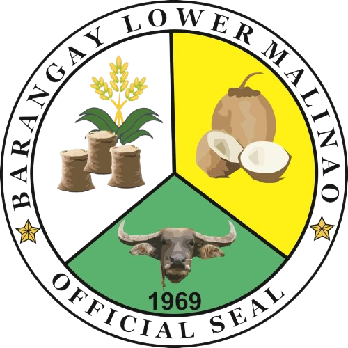

<div align="center">
  
  <h1>Barangay Resource & Management Monitoring System (BARMMS)</h1>
  <p>A unified Laravel + Python platform for barangay programs, requests, health data, and analytics.</p>
</div>

## Overview

BARMMS digitizes day-to-day barangay operations—account requests, document workflows, blotter tracking, medicine inventory, vaccination records, health center activities, announcements, and analytics.  
The stack couples a Laravel 12 backend + Blade frontends with a Flask-based analytics microservice that handles clustering, decision trees, and recommendation models.

```
/app                  Laravel domain logic, controllers, services
/resources/views      Blade templates for admin + resident portals
/analytics_service    Flask API, scikit-learn models, clustering/ML helpers
```

## Highlights
- Multi-role administration (captain, secretary, nurse, treasurer, councilors) with middleware-based access control
- Resident self-service for blotter/document/community concerns plus live status tracking
- Health center toolkit: vaccinations, medical records, medicines inventory, activity scheduling, analytics exports
- Integrated clustering/decision-tree dashboards backed by the Python service
- Notification center + email templates for approvals, summons, and password resets

## Tech Stack

| Layer    | Technology                                   |
| -------- | -------------------------------------------- |
| Backend  | Laravel 12, PHP 8.2, Sanctum, Eloquent ORM   |
| Frontend | Blade, Alpine.js, Tailwind (via Vite)        |
| Storage  | MySQL / MariaDB, optional Redis cache/queue  |
| Analytics| Flask + scikit-learn + pandas (`analytics_service/`) |

## Requirements

| Service | Version |
| ------- | ------- |
| PHP     | 8.2+ (w/ BCMath, Ctype, Fileinfo, JSON, Mbstring, OpenSSL, PDO, Tokenizer, XML) |
| Node    | 18+ (for Vite + frontend assets) |
| Composer| 2.x     |
| Python  | 3.9+ (for analytics service) |
| MySQL   | 8+ or MariaDB 10.6+ |

## Setup (Laravel)

```bash
cp .env.example .env           # configure DB, mail, python service URL
composer install
php artisan key:generate
php artisan migrate --seed     # seeds residents, medicines, templates, etc.
npm install && npm run build   # or `npm run dev` during local work
php artisan serve              # app at http://127.0.0.1:8000/
```

Important `.env` keys:

```
APP_URL=http://localhost:8000
PYTHON_ANALYTICS_URL=http://127.0.0.1:5000
PYTHON_ANALYTICS_ENABLED=true
QUEUE_CONNECTION=database
CACHE_STORE=redis|file
```

## Setup (Analytics Service)

```bash
cd analytics_service
python -m venv .venv
.venv\Scripts\activate              # or source .venv/bin/activate
pip install -r requirements.txt
python app.py                       # Flask on http://127.0.0.1:5000
```

Models are saved under `analytics_service/models/`. Keep only the most recent `.pkl` + encoder pair to reduce repo size; older artifacts can be regenerated by retraining via the admin dashboard decision-tree tools.

## Running the full stack

1. Start MySQL and ensure `.env` credentials match.
2. Run `php artisan serve` (or point Apache/Nginx to `public/index.php`).
3. Start the queue worker if background notifications are enabled:
   ```bash
   php artisan queue:listen --tries=1
   ```
4. Launch Vite in watch mode for asset updates: `npm run dev`.
5. Activate the Flask analytics API as shown above.

Visit `/login` for admins, `/resident/login` for resident users (seed credentials are defined in the seeders).

## Testing & QA

```bash
php artisan test                 # feature + unit tests
php artisan pint                 # code style (PSR-12)
npm run test                     # placeholder if you add JS tests
```

Key smoke tests before deployment:
- Account request flow (guest ➜ admin approval ➜ email)
- Resident requests (blotter, document, community concern)
- Medicine inventory adjustments + request approvals
- Document template uploads (DOCX + custom placeholders)
- Analytics dashboard: clustering, decision tree stats, resident predictions

## Deployment Checklist

- `php artisan config:cache && route:cache`
- Upload only the latest ML models needed by production
- Ensure Python service runs under a process manager (e.g., Supervisor, Systemd)
- Configure cron for Laravel scheduler: `* * * * * php /path/to/artisan schedule:run`
- Point storage symlink: `php artisan storage:link`

## Contributing

1. Fork + branch from `main`
2. Follow PSR-12 for PHP, PEP8 for Python, and include tests
3. Open a PR describing scope, screenshots for UI work, and steps to reproduce

## License

This project inherits the default Laravel MIT license. See `LICENSE` for details.
